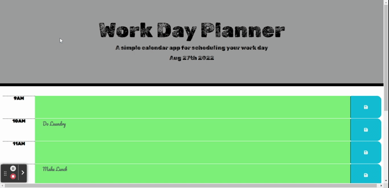

# Work Day Planner

## Description

Given source code for basic HTML structure, JQuery logic and CSS styles, created an interactive work day planner. The planner shows the current date at the top of the page and shows past, current and future hours of the day. The past hours are grey, the current hour is red and the future hours are green. Within each hour row, users can store events, notes or other text within the middle column and save the information using the save button on the right. Once the information is saved, if the user refreshes the page or decides to visit the page at a later time, their saved text will still be there. The user can edit the text at any time, including clearing the text field and saving it empty.

Ultimately, this interactive planner allows users to track their day with the color coded sections for time and storing any events or notes that need to be referenced at a later time.

## Live Link

https://torbitj.github.io/work-day-planner/

## Github Link

https://github.com/torbitj/work-day-planner

## Preview

